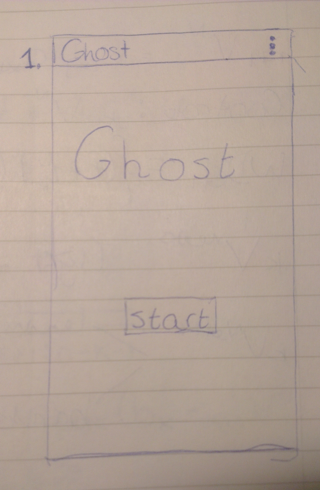
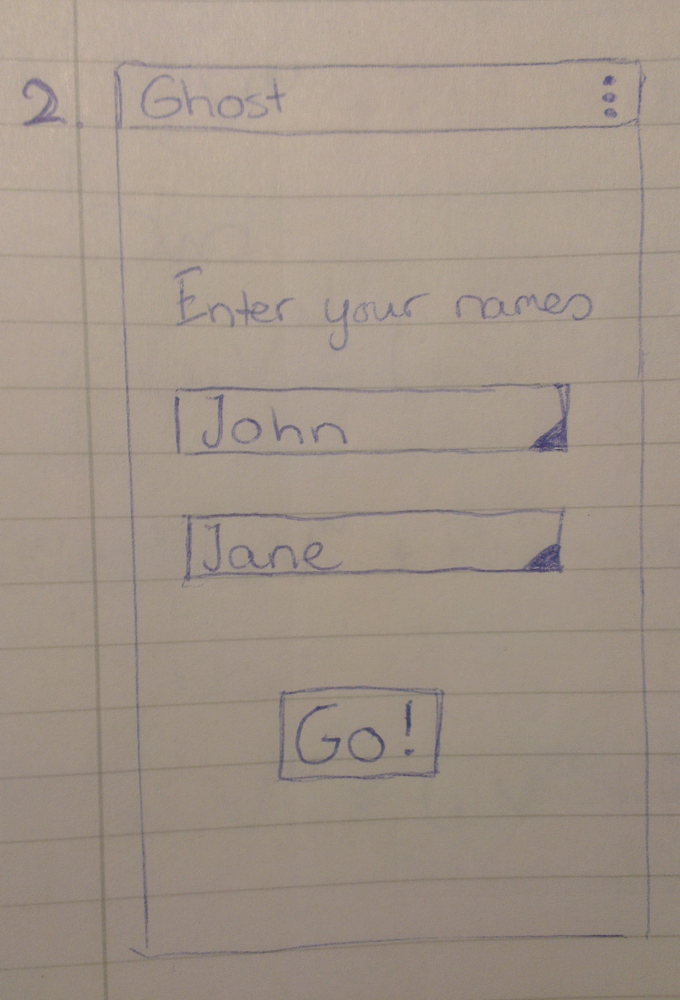
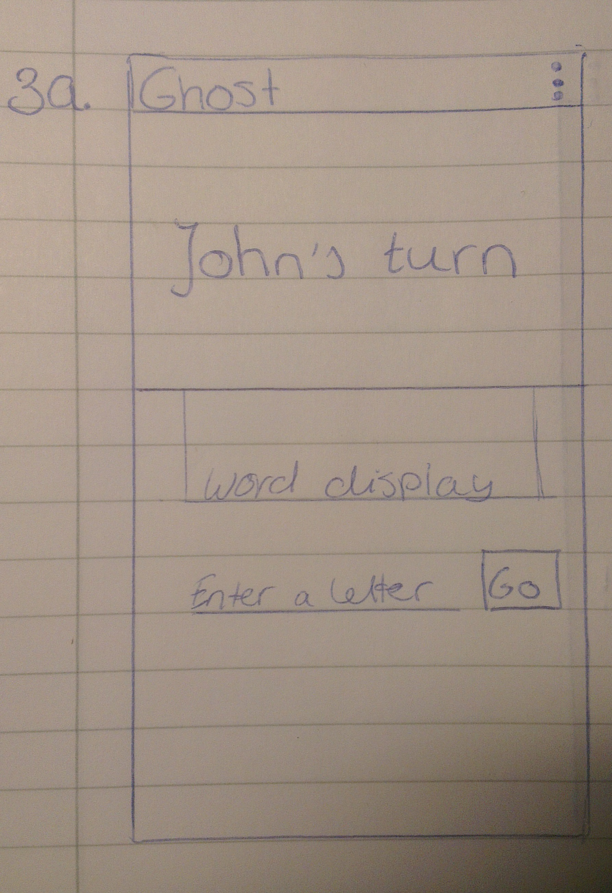
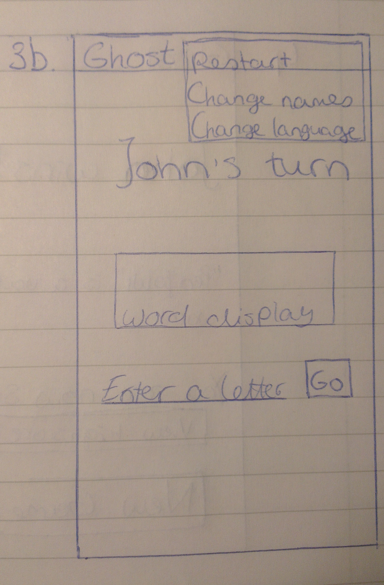
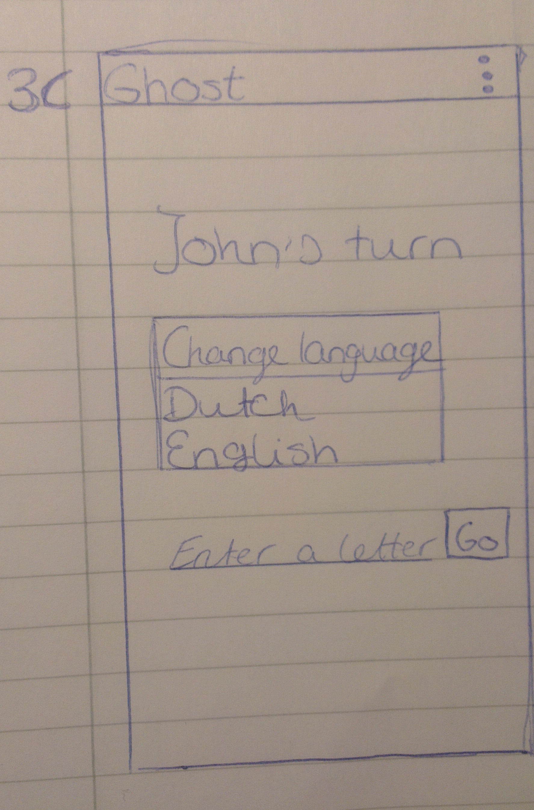
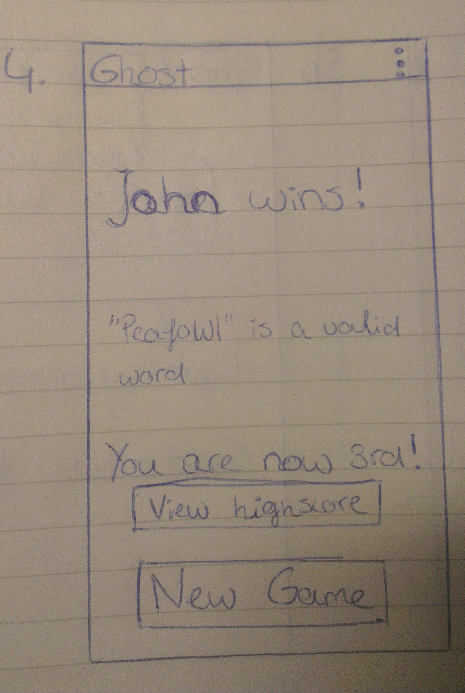
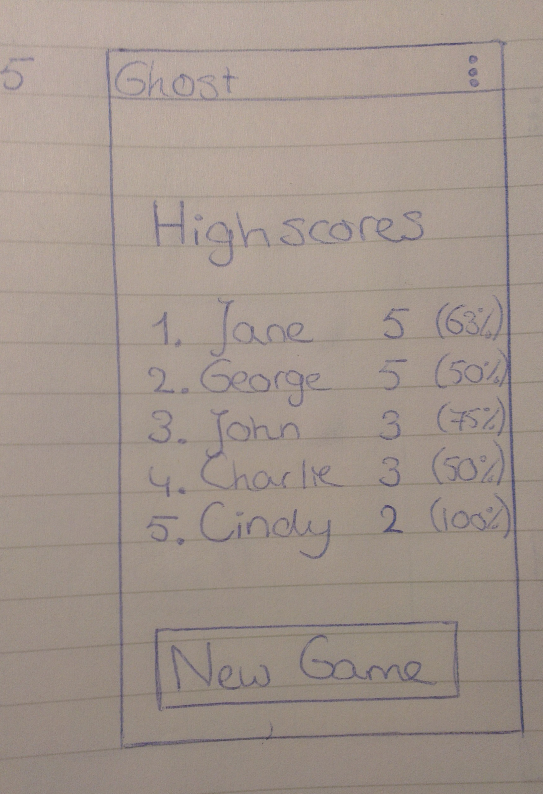

# Ghost

#### Summary
This app is the game Ghost which is a word game for two players on the same device. A player loses the game by choosing an invalid letter or by making an existing word, consisting of four or more letters.

#### Features
This app has the following features:

1.  It asks for both the players names and remembers them in following games.
2.  There is a possibility to add your name and score to the highscore board
3.  The players take turns on choosing a letter via an on-screen keyboard. 
4.  There is a choice of dictionaries: English and Dutch.
5.  A player can change his or her name during the game play.
6.  A player can change the language, but that will cause the game to restart.
6.  The app works with an SDK API level of 21 (Android 5).
7.  The app can be used on smartphones and tablets.

#### Sketches

1. Opening screen:

2. Choose names for the players:

3. Playing the game. The current player's name is shown above the current state of the word. The current player must choose a certain alphabetical character.

In the options menu the game can be restarted. Also the names and the language can be changed.

 

4. This player has won and will know the place in the highscores list. The game can be restarted immediately.

5. If the winning player wants to view the highscores, the corresponding button can be clicked, which leads to the following screen.

