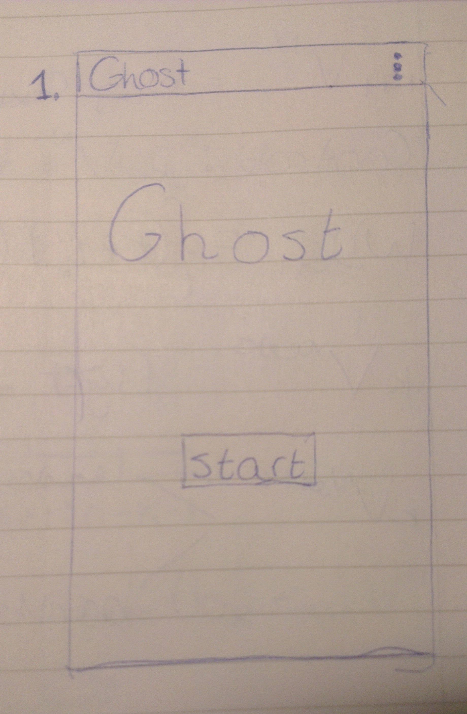

# Design

#### Screen 1: OpeningScreen

Views:
* TextView: title
* Button: 'Start'. Calls onStartButtonClick()

Methods:
* void onStartButtonClick(). Goes to SetNamesScreen 

#### Screen 2: SetNamesScreen

#### Screen 3: MainActivity

#### Screen 4: WinScreen

#### Screen 5: HighscoresScreen

