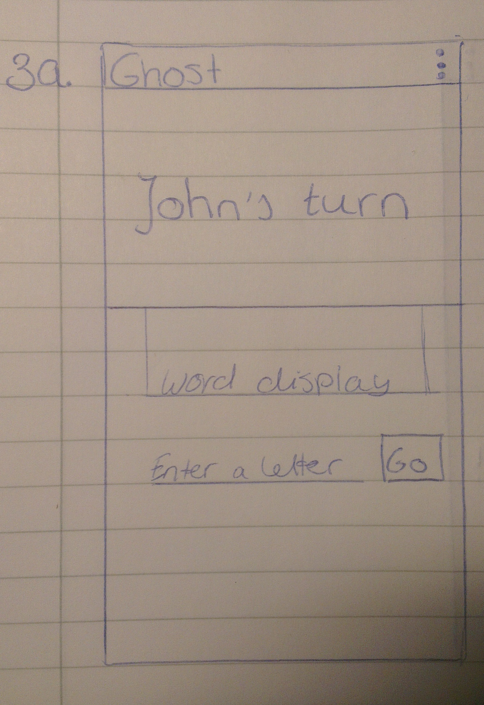
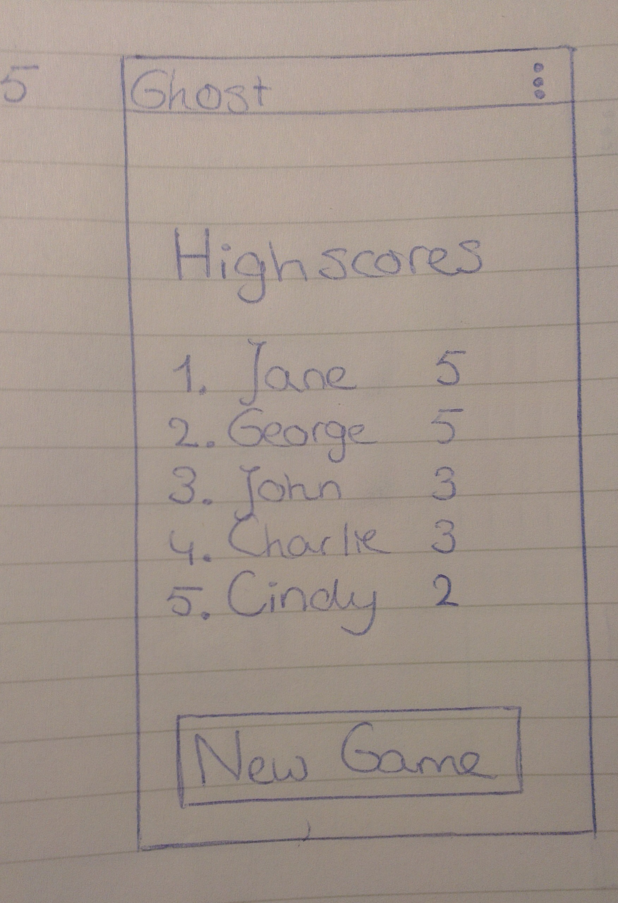

# Design

#### Screen 1: OpeningScreen

Views:  
1.  TextView: title  
2.  Button: 'Start'. Calls onStartButtonClick()  

Methods:  
1.  void onStartButtonClick().   
    - Goes to SetNamesScreen   

#### Screen 2: SetNamesScreen

Views:  
1.  TextView: 'Enter your names'  
2.  Spinner 1: contains all names ever used  
3.  Spinner 2: contains all names ever used, except for the one in spinner 1.  
4.  Button: 'Go'. Calls startNewGameWithNames()  

Methods:  
1.  void startNewGameWithNames().   
    -   Saves the names in public strings list  
    -   Calls startNewGame()  
2.  void startNewGame().   
    -   Chooses random player  
    -   Initializes word  
    -   Goes to MainActivity  

#### Screen 3: MainActivity

Views:
1.  TextView: 'John's turn'  
    -   Or 'Hans' turn' if it ends with a 's', 'z' or 'x'.  
2.  TextView: display of the current word  
3.  EditText: new letter.  
    -   The length is forced to 1.  
4.  Button: 'Go'. Calls makeMove(letter).  

Methods:
1.  void onCreate(Bundle savedInstanceState)  
    -   if the static lists of dictionaries (English and Dutch) are empty: setDictionaries().  
2.  void setDictionaries()  
    -   for each of the empty lists:   
        -   make a scanner  
        -   read in the words from a file  
        -   save the words in the list of strings  
3.  void makeMove(int letter).   
    -   call checkValidLetter(letter)  
    -   call addLetterToWord(letter)  
    -   call checkForLost()  
        -   if not lost:  
            -   setNextPlayer()  
            else:  
            -   call editHighScores()  
            -   create intent containing the winner's name and the boolean isWholeWord  
            -   go to WinScreen with this intent  
4.  Boolean checkValidLetter(int letter)  
5.  void addLetterToWord()  
6.  Boolean checkForLost()  
    -   find the word in the dictionary that is the next word in alphabetical order  
    -   if the current word is not a fragment of this word (beginning at the first letter), return true  
    -   else if it is equal to the current word, return true  
    -   else return false  
7.  void setNextPlayer()  
    -   change the name in the TextView  
    -   change the colour  

#### Screen 4: WinScreen

Views:  

Methods:  

#### Screen 5: HighscoresScreen

Views:  

Methods:  
