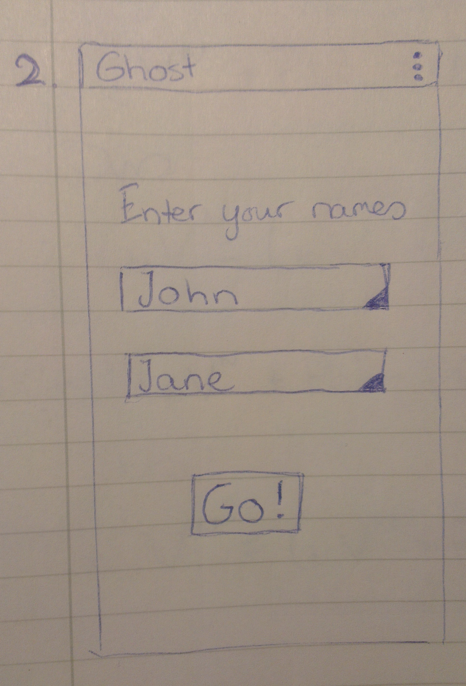

# Design

#### Screen 1: OpeningScreen

Views:

1.  TextView: title
2.  Button: 'Start'. Calls onStartButtonClick()

Methods:

1.  void onStartButtonClick(). 
    1.  Goes to SetNamesScreen

#### Screen 2: SetNamesScreen

Views:

1.  TextView: 'Enter your names'
2.  Spinner 1: contains all names ever used
3.  Spinner 2: contains all names ever used, except for the one in spinner 1.
4.  Button: 'Go'. Calls startNewGameWithNames()

Methods:

1.  void startNewGameWithNames(). 
    1.   Saves the names in public strings list
    2.   Calls startNewGame()
2.  void startNewGame(). 
    1.   Chooses random player
    2.   Initializes word 
    3.   Goes to MainActivity

#### Screen 3: MainActivity

Views:

1.  TextView: 'John's turn'
    1.  Or 'Hans' turn' if it ends with a 's', 'z' or 'x'.
2.  TextView: display of the current word
3.  EditText: new letter.
    1.  The length is forced to 1.
4.  Button: 'Go'. Calls makeMove(letter).

Methods:

1.  void onCreate(Bundle savedInstanceState)
    1. if the static lists of dictionaries (English and Dutch) are empty: setDictionaries(). 
2.  void setDictionaries()
    1.  for each of the empty lists: 
        1.  make a scanner
        2.  read in the words from a file
        3.  save the words in the list of strings
3.  void makeMove(int letter). 
    1.  call checkValidLetter(letter)
    2.  call addLetterToWord(letter)
    3.  call checkForLost()<
        1.  if not lost:
            1.  setNextPlayer()
        2.  else:
            1.  call editHighScores()
            2.  create intent containing the winner's name and the boolean isWholeWord
            3.  go to WinScreen with this intent
4.  Boolean checkValidLetter(int letter)
5.  void addLetterToWord() 
6.  Boolean checkForLost()
    1.  find the word in the dictionary that is the next word in alphabetical order
    2.  if the current word is not a fragment of this word (beginning at the first letter), return true
    3.  else if it is equal to the current word, return true
    4.  else return false
7.  void setNextPlayer()
    1.  change the name in the TextView
    2.  change the colour

#### Screen 4: WinScreen

Views:

Methods:

#### Screen 5: HighscoresScreen

Views:

Methods:
