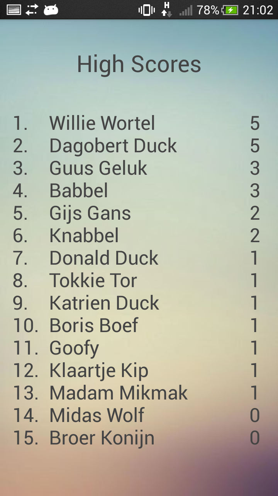
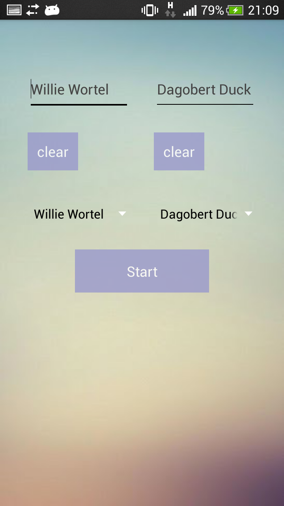
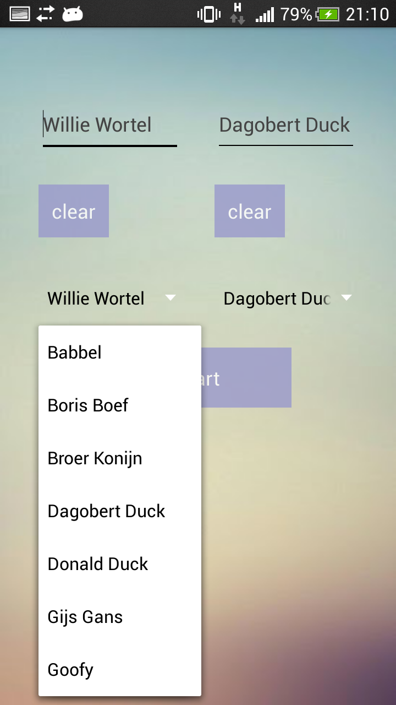
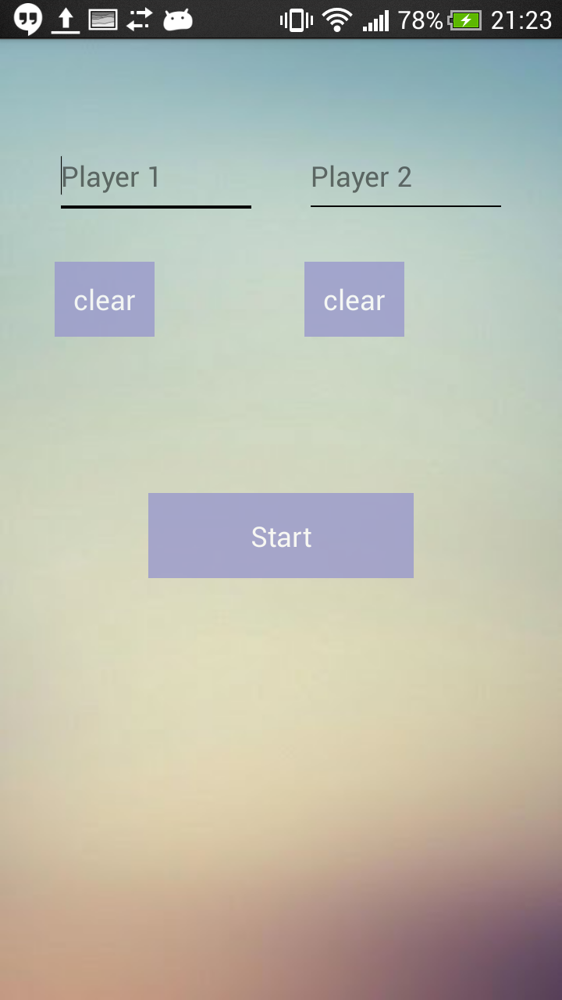
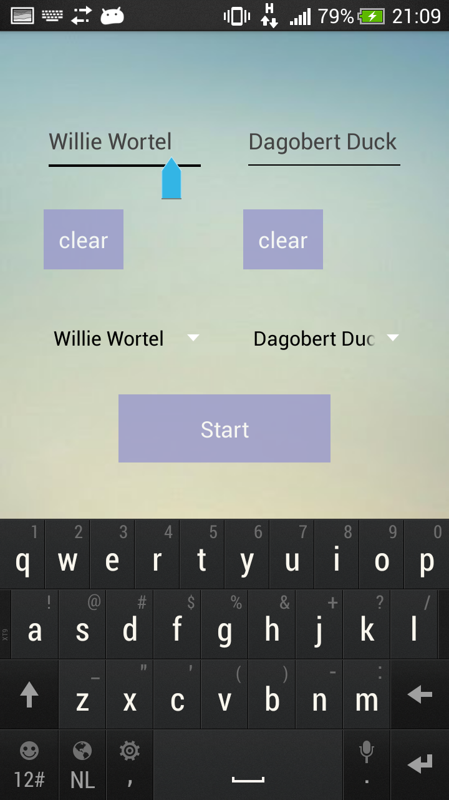
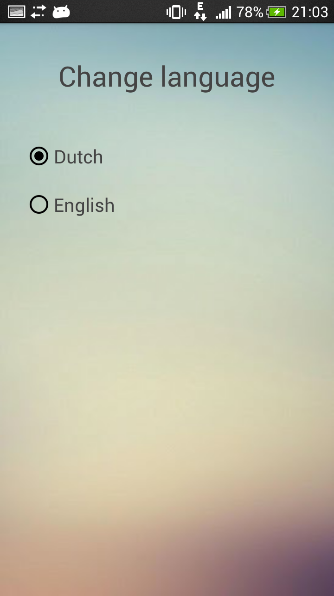

# Verslag

## Activities

### MainActivity

Dit is het hoofdscherm, waarin het spel wordt gespeeld. Hier is te zien wie er aan de beurt is en wat het woord tot nu toe is. 

In dit scherm zijn er ook een aantal menu-opties toegevoegd, namelijk "Restart game", "Change players" en "Change language".

In de EditText kan een letter geplaatst worden en om een zet te doen, moet er op Enter gedrukt worden via het on-screen-toetsenbord. Als er daarna niet wordt gewonnen, is de andere speler aan de beurt en wordt het woord direct bijgewerkt.

###### protected void onCreate(Bundle savedInstanceState)
Initialiseren van de widgets en de lijst van dictionaries. Het roept loadDictionaries en initiateGameState aan.

###### public boolean onCreateOptionsMenu(Menu menu)
Creeeren van het menu.

###### public boolean onOptionsItemSelected(MenuItem item) 
Het spel kan worden herstart, er kan een andere taal worden gekozen en er kunnen andere namen voor de spelers worden gekozen.

###### public void loadDictionaries()
Laden van de dictionaries voor Engels en Nederlands. Beide dictionaries worden in de lijst all_dictionaries geplaatst.

###### public void changePlayerNames()
Een intent wordt gemaakt om naar NameActivity te gaan met startActivityForResult, met de namen van de spelers en de highscores-gegevens. 

###### protected void onActivityResult(int requestCode, int resultCode, Intent data)
Afhandelen van de resultaten van intents die van NameActivity, WinActivity of LanguageActivity kwamen.

###### protected void onStart()
Als er nog geen namen zijn, dan wordt changeNames() aangeroepen. Anders ofwel display() of toWinActivity().

###### public void enterLetter()
Dit wordt aangeroepen als er op er op de Enter knop in het toetsenbord is gedrukt. Er wordt een stap gemaakt in de gamePlay met de ingevoerde letter.

###### public void display()
Toont de huidige spelsituatie.

###### public void toWinActivity()
Dit wordt aangeroepen als het spel afgelopen is. Er wordt een intent gemaakt om naar WinActivity te gaan met startActivityForResult, omdat het nodig is om te weten of er nog wordt gewisseld van spelers of niet.

###### protected void onStop()
Voordat de app wordt gestopt, wordt eerst saveGameState() aangeroepen om gegevens op te slaan.

###### public void onBackPressed()
Als er op 'terug' wordt gedrukt, gaat de app naar NameActivity, in plaats van dat de app afsluit. 

###### public void saveGameState()
Gegevens worden opgeslagen zoals de namen van de spelers, de taal en de gegevens van gamePlay en highScores die worden opgeslagen met gamePlay.saveGameState en highScores.saveGameState

###### public void initiateGameState()
Gegevens worden gevonden zoals de namen van de spelers, de taal en de gegevens van gamePlay en highScores die worden gevonden met gamePlay.recallGameState en highScores.recallGameState. 

### WinActivity

Als het spel is gewonnen, wordt er dit scherm getoond. Hier is de winnaar te zien, het woord en de reden waarom er gewonnen is. Onderaan staat de plaats in de High Scores lijst en eventueel de oude plaats als de speler in de ranking gestegen is. 

Er zijn verschillende knoppen in dit scherm. De knop met "New Game" laat een nieuw spel starten met dezelfde spelers en gaat dus naar MainActivity. De knop eronder laat ook een nieuw spel starten, maar komt eerst in NameActivity. Ten slotte is onderaan de knop om naar RankingActivity te gaan om de ranking te zien.

### RankingActivity

Dit scherm toont de ranking van de 15 hoogst scorende spelers. Om terug te gaan naar WinActivity moet er op de terugknop gedrukt worden.

### NameActivity

Hier kunnen de namen van de spelers worden gekozen. In de EditText bovenaan kunnen de namen worden getypt en beide EditTexts hebben een "clear"-knop eronder. 

Er kan ook gebruik worden gemaakt van de Spinners die alle namen bevatten van spelers die eerder een spel hebben gespeeld (en afgemaakt). Als er nog niet eerder namen gekozen zijn, dan worden de Spinners niet getoond.

Om het spel met de huidige namen te spelen kan er op de "Start"-knop worden gedrukt of op de Enter-toets in het on-screen-toetsenbord. 

### LanguageActivity

Tijdens een spel kan een speler ervoor kiezen om de taal te veranderen. Dan komt de speler in dit scherm, waarbij er gekozen kan worden tussen talen door middel van RadioButtons in een RadioGroup. De mogelijke talen zijn Nederlands en Engels. Als een van de talen is aangevinkt, gaat de app terug naar MainActivity.

## Classes

### Dictionary

### GamePlay

### HighScores

