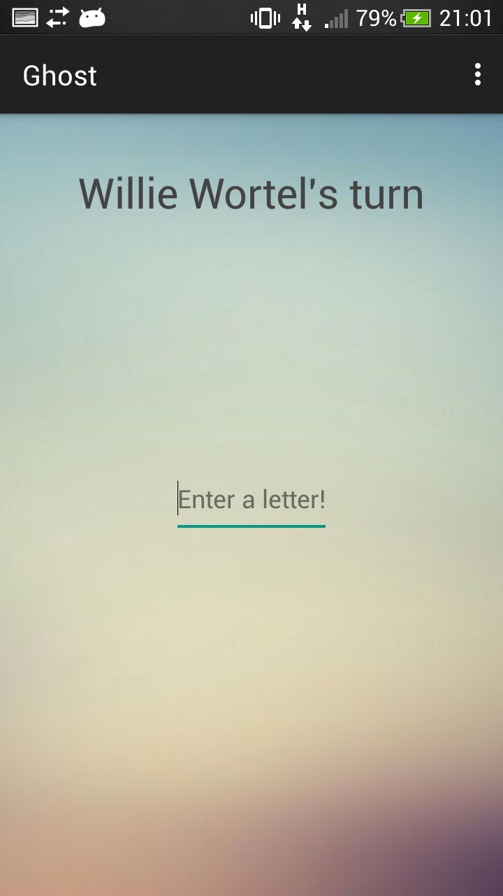
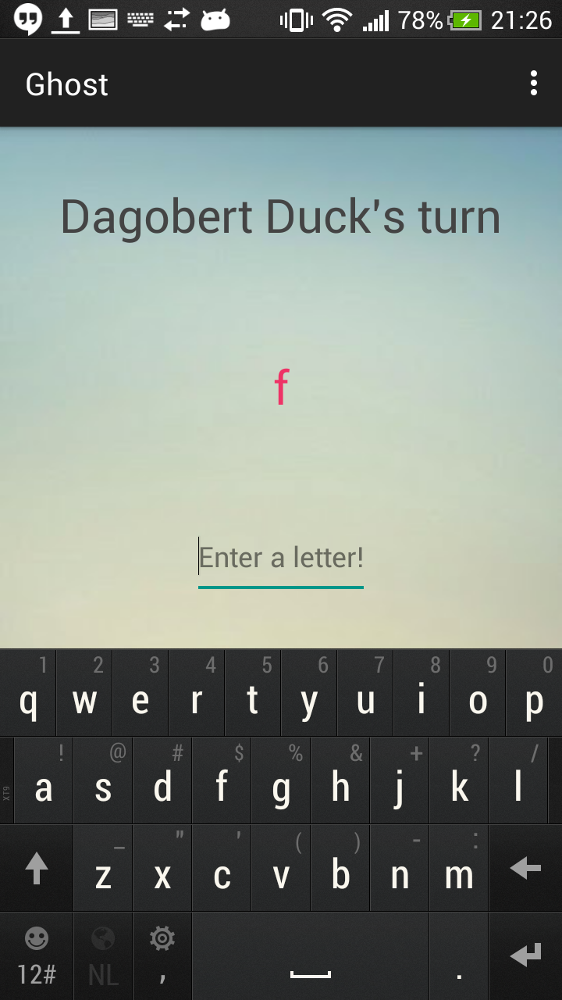
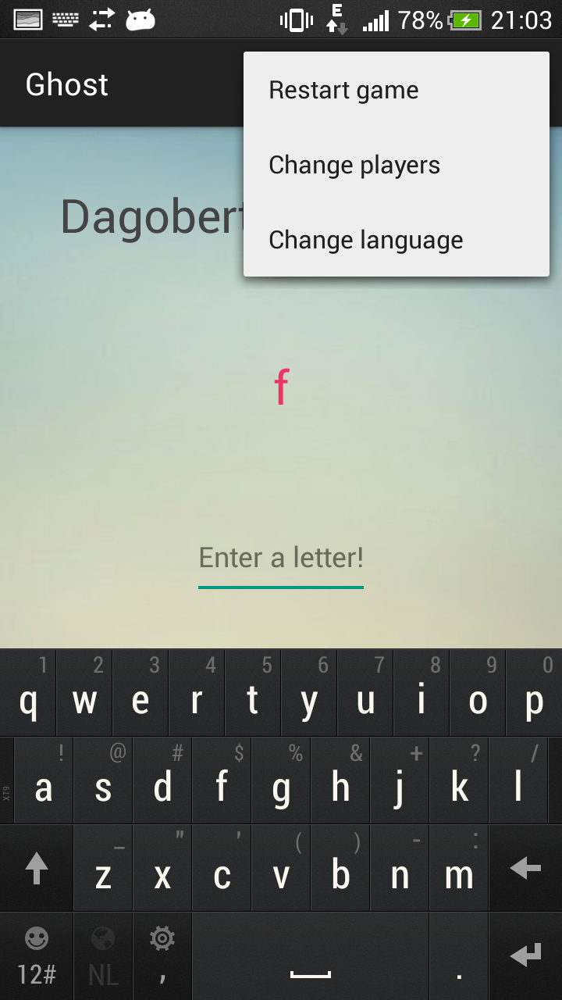
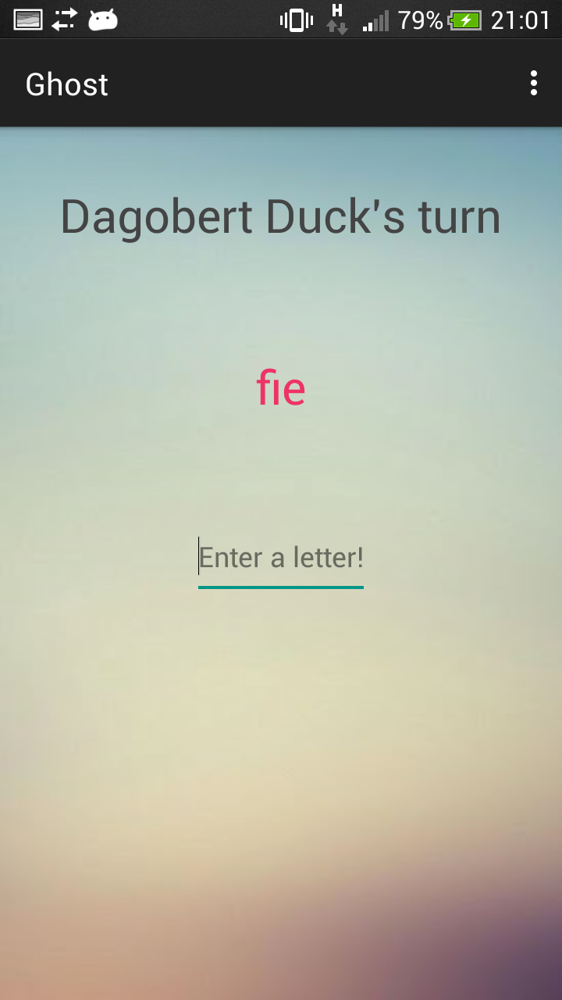
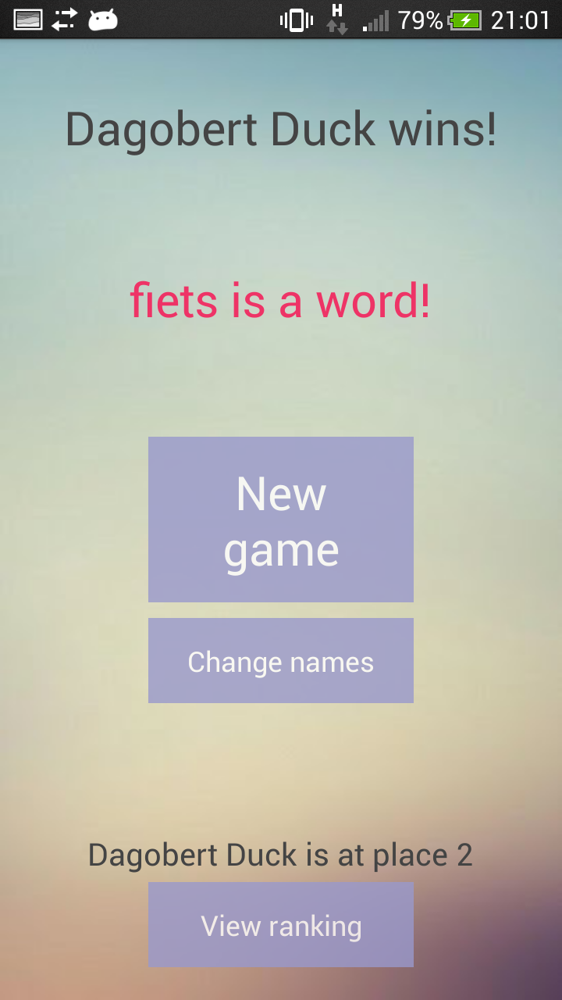
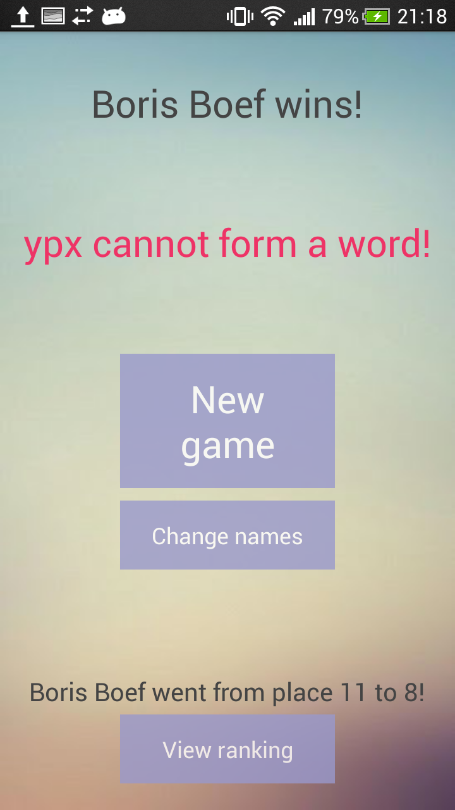

# Verslag

## Activities

### MainActivity

Dit is het hoofdscherm, waarin het spel wordt gespeeld. Hier is te zien wie er aan de beurt is en wat het woord tot nu toe is. 

In dit scherm zijn er ook een aantal menu-opties toegevoegd, namelijk "Restart game", "Change players" en "Change language".

In de EditText kan een letter geplaatst worden en om een zet te doen, moet er op Enter gedrukt worden via het on-screen-toetsenbord. Als er daarna niet wordt gewonnen, is de andere speler aan de beurt en wordt het woord direct bijgewerkt.

### WinActivity

Als het spel is gewonnen, wordt er dit scherm getoond. Hier is de winnaar te zien, het woord en de reden waarom er gewonnen is. Onderaan staat de plaats in de High Scores lijst en eventueel de oude plaats als de speler in de ranking gestegen is. 

Er zijn verschillende knoppen in dit scherm. De knop met "New Game" laat een nieuw spel starten met dezelfde spelers en gaat dus naar MainActivity. De knop eronder laat ook een nieuw spel starten, maar komt eerst in NameActivity. Ten slotte is onderaan de knop om naar RankingActivity te gaan om de ranking te zien.

### RankingActivity

Dit scherm toont de ranking van de 15 hoogst scorende spelers. Om terug te gaan naar WinActivity moet er op de terugknop gedrukt worden.

### NameActivity

Hier kunnen de namen van de spelers worden gekozen. In de EditText bovenaan kunnen de namen worden getypt en beide EditTexts hebben een "clear"-knop eronder. Er kan ook gebruik worden gemaakt van de Spinners die alle namen bevatten van spelers die eerder een spel hebben gespeeld (en afgemaakt).

Om het spel met de huidige namen te spelen kan er op de "Start"-knop worden gedrukt of op de Enter-toets in het on-screen-toetsenbord.

### LanguageActivity

Tijdens een spel kan een speler ervoor kiezen om de taal te veranderen. Dan komt de speler in dit scherm, waarbij er gekozen kan worden tussen talen door middel van RadioButtons in een RadioGroup. De mogelijke talen zijn Nederlands en Engels. Als een van de talen is aangevinkt, gaat de app terug naar MainActivity.

## Classes

### Dictionary

### GamePlay

### HighScores

